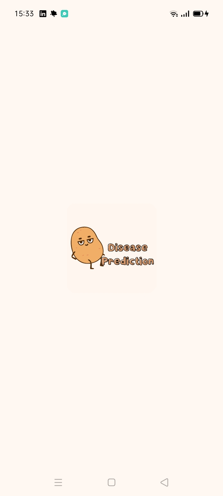
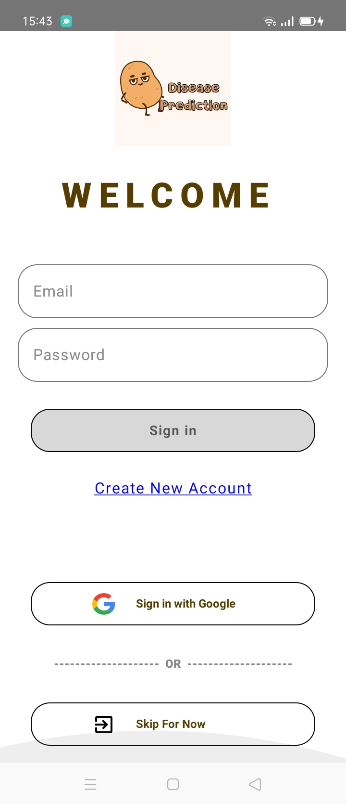
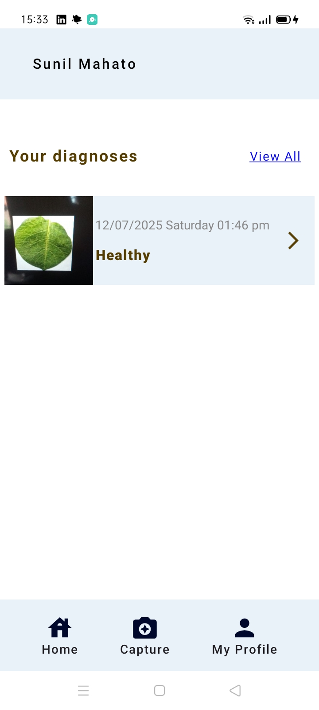
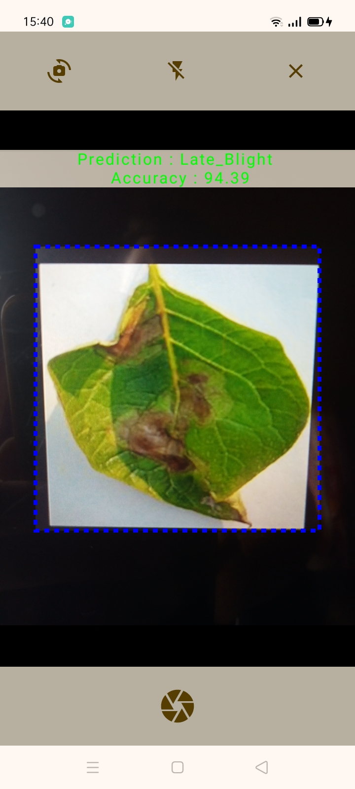
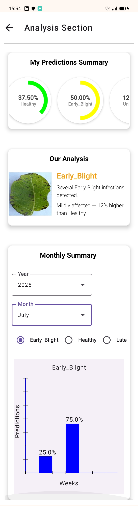
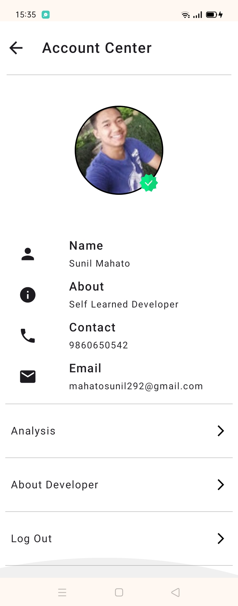
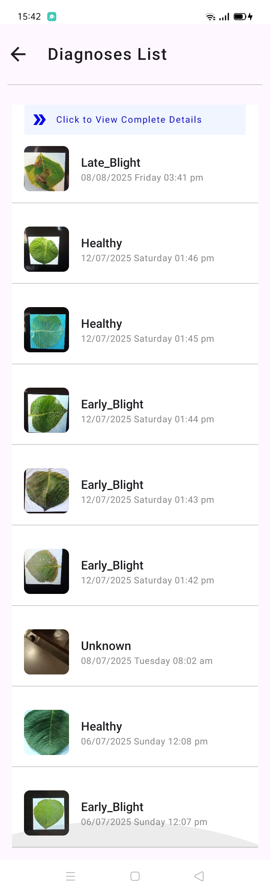

---

# Potato Disease Prediction System 🥔🔍

[](https://kotlinlang.org/docs/home.html)
[](https://developer.android.com/jetpack/compose)
[](https://www.tensorflow.org/lite)
[](https://firebase.google.com/)
[](https://developer.android.com/)
[](https://creativecommons.org/licenses/by-nc-nd/4.0/)

---

**Potato Disease Prediction System (PDP System)** is a **Kotlin + Jetpack Compose Android application** that uses **Machine Learning** to detect potato plant diseases in **real-time** via the **CameraX API**.
It can predict **Early Blight**, **Late Blight**, **Healthy**, or **Unknown** instantly, and securely syncs your results to the **cloud** for cross-device access.

This app is designed for **agriculture technology enthusiasts**, **researchers**, and **farmers** looking for a quick and mobile-friendly diagnosis tool.

---

## 📑 Table of Contents

* [✨ Features](#-features)
* [🛠 Tech Stack](#-tech-stack)
* [🎥 Demo](#-demo)
* [⚠️ Disclaimer](#️-disclaimer)
* [📱 Installation](#-installation)
* [📥 Download APK](#-download-apk)
* [📃 License and Usage](#-license-and-usage)
* [🖼 Screenshots](#-screenshots)

---

## ✨ Features

* 🎯 **Real-Time Disease Detection**
  Predict potato plant health directly from the live camera feed using **CameraX API**.

* 🧠 **Custom CNN Model (TensorFlow Lite)**
  A **Convolutional Neural Network** trained specifically for potato disease detection with \~90% accuracy.

* 📸 **In-Camera Prediction**
  No manual photo capture needed — predictions are generated **live** while scanning.

* 🔐 **Secure Authentication**
  Login using **Email & Password** or **Google Sign-In** powered by Firebase Authentication.

* ☁️ **Cloud-Synced Prediction History**
  Predictions are stored in **Firebase Firestore** and synced across devices.

* 📜 **Prediction History**
  Review all past predictions, including date and time.

* 📊 **Monthly Summary**
  View monthly analytics of prediction activity.

* 👤 **Account Center**
  Manage your profile and log out anytime.

* 📄 **Prediction Summary**
  Detailed breakdown of each prediction result.

---

## 🛠 Tech Stack

| Technology             | Usage                                  |
| ---------------------- | -------------------------------------- |
| **Kotlin**             | Primary programming language           |
| **Jetpack Compose**    | Declarative UI framework               |
| **CameraX API**        | Real-time camera access & analysis     |
| **TensorFlow Lite**    | On-device ML predictions               |
| **Firebase Auth**      | Email/Password & Google authentication |
| **Firebase Firestore** | Cloud database for predictions         |
| **Material Design 3**  | Modern Android UI design               |

---

<!-- ## 🎥 Demo 

| Real-Time Detection    | Prediction History    | Monthly Summary       |
| ---------------------- | --------------------- | --------------------- |
|  |  |  |

---
-->

## ⚠️ Disclaimer

This application is intended for **educational and testing purposes only**.
It should **not** be considered a replacement for professional agricultural diagnosis.
Accuracy may vary based on lighting, camera quality, and plant condition.

---

## 📱 Installation

1. Download the latest APK from the [Releases Page](#-download-apk).
2. Enable **installation from unknown sources** in device settings.
3. Open the APK and follow the installation steps.
4. Login via **Email/Password** or **Google account**.
5. Start scanning potato leaves for instant predictions.

---

## 📥 Download APK

🔗 [**Download Latest APK**](https://github.com/Mahato-Sunil/pdp-system-apk/releases/tag/apk)

---

## 📃 License and Usage

```
Copyright (c) 2025 Sunil Mahato

All rights reserved.

This APK is provided for personal testing and educational purposes only.  
Redistribution, reverse engineering, modification, or commercial use is strictly prohibited without written permission from the author.
```

📩 For any Queries: **[sunilmaht642@gmail.com](mailto:sunilmaht642@gmail.com)**

[](https://creativecommons.org/licenses/by-nc-nd/4.0/)

---

## 🖼 Screenshots

### Splash Screen 

 

### Login Page

  

### Home Screen

  

### Camera Prediction Screen

  

### Prediction Summary

  

### Account Center

  

### Prediction History

  


### Diesease Prediction

 

---
